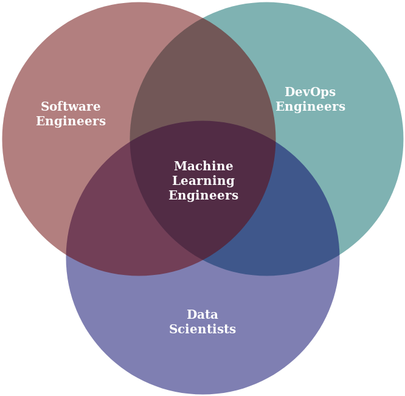
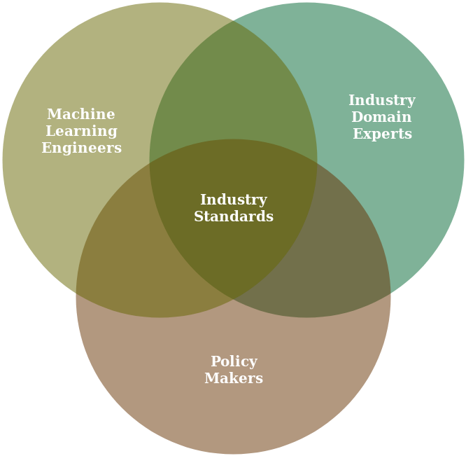
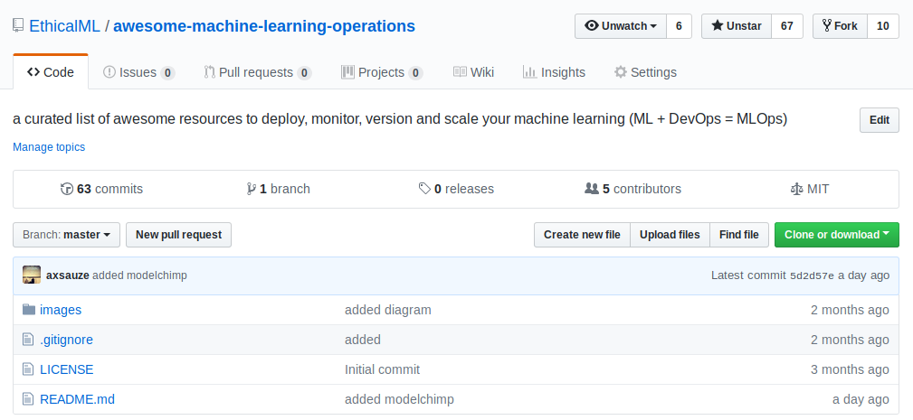
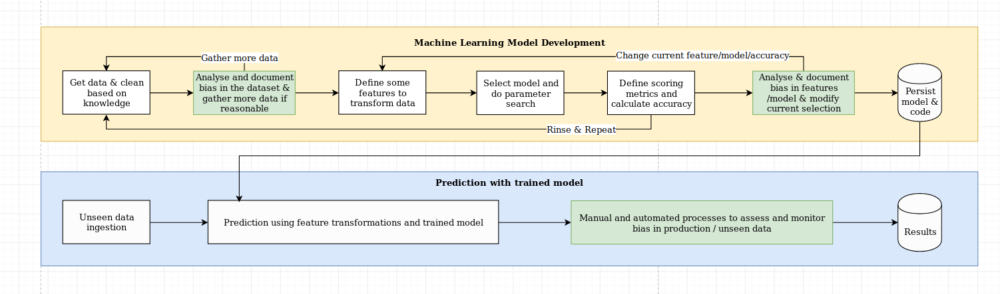
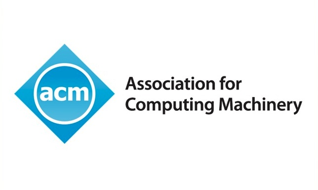

<!-- .slide: data-background="images/network-background.jpg" class="background" -->

<h3>The Institute for Ethical AI & ML</h3>
<h1>Strategy meeting #1</h1>

   
   
    Alejandro Saucedo   
    <a href="http://twitter.com/AxSaucedo">@AxSaucedo</a> 
    <a href="http://linkedin.com/in/AxSaucedo">in/axsaucedo</a> 
   

[NEXT]
<!-- .slide: data-background="images/network-background.jpg" class="background smallquote" -->

## Today

> Intros + Overview
>  
>  
> Updates
>
> [Break] + Strategy
> 
> Next steps

[NEXT]
<!-- .slide: data-background="images/network-background.jpg" class="background smallquote" style="color: white" -->

## Introductions

* Beth West - Head of Development London, Landsec
* Adam Kosiorek - Researcher, U.of Oxford
* Lucy Yu - Director of Public Policy, FiveAI
* Alex Housley - CEO, Seldon 
* Tom McGinn - Associate, Cooley LLP
* Tim Haynes - Science Officer, US Embassy
* Dr. Owen King - Ethicist & Researcher, U. of Twente
* Hezron Rickets - CSO, The3rdCurve

[NEXT]
<!-- .slide: data-background="images/particles.gif" class="background smallquote" -->

# #LetsDoThis

[NEXT SECTION]
<!-- .slide: data-background="images/parti.png" class="background smallquote" style="color: white" -->

# 1. Overview

[NEXT]
<!-- .slide: data-background="images/parti.png" class="background smallquote" style="color: white" -->
# Vision

Build the Bell Labs of the 21st Century by delivering breakthrough contributions through applied AI research

[NEXT]
<!-- .slide: data-background="images/parti.png" class="background smallquote" style="color: white" -->
## About the institute

We are a UK-based research centre formed by cross functional teams of applied STEM researchers, philosophers, industry experts and software engineers 

## Applied research

We develop industry frameworks and practical research that empowers technologists to design, develop and deploy of machine learning systems responsibly.

[NEXT]
<!-- .slide: data-background="images/partistat.png" class="background smallquote" style="color: white" -->

## The new complexity

[NEXT]
<!-- .slide: data-background="images/partistat.png" class="background smallquote" style="color: white" -->

## It gets harder

[NEXT]
<!-- .slide: data-background="images/partistat.png" class="background smallquote" style="color: white" -->
## The moral-consciousness matrix

| | | |
| - | - | - |
| | Conscious | Unconscious | 
| Moral | 🤩| 🤨 |
| Immoral | 👹| 🤪 |
| | | |

 
<h3>Moral === Wants to do good</h3>
<h3>Conscious === Knows how to</h3>

[NEXT]
<!-- .slide: data-background="images/partistat.png" class="background smallquote" style="color: white" -->

## IEML phased workstreams
* **Phase 1 - Responsible ML by principle**
    * For technologists to implement  
* **Phase 2 - Responsible ML by process**
    * For technology leaders to introduce  
* **Phase 3 - Responsible ML by certification**
    * For industries to raise the bar  
* **Phase 4 - Responsible ML by regulation**
    * For economies to thrive

[NEXT]
<!-- .slide: data-background="images/partistat.png" class="background smallquote" style="color: white" -->
## The core Principles

<iframe style="height: 50vh; width: 100vw" src="http://ethical.institute#principles"></iframe>

[NEXT]
<!-- .slide: data-background="images/partistat.png" class="background smallquote" style="color: white" -->

# [DISCUSSION: Core]

_note_

[NEXT SECTION]
<!-- .slide: data-background="images/partistat.png" class="background smallquote" style="color: white" -->

# 2. Updates

[NEXT]
<!-- .slide: data-background="images/partistat.png" class="background smallquote" style="color: white" -->

## Phase 1: By principle

[NEXT]
<!-- .slide: data-background="images/partistat.png" class="background smallquote" style="color: white" -->

## The Machine Learning Operations List

[NEXT]
<!-- .slide: data-background="images/partistat.png" class="background smallquote" style="color: white" -->

## Ethical AI Network Launch

<iframe style="height: 50vh; width: 100vw" src="http://ethical.institute#network"></iframe>

[NEXT]
<!-- .slide: data-background="images/partistat.png" class="background smallquote" style="color: white" -->

## 40+ Ethical AI members

* Professors & researchers in Computer Science, AI, Philosophy, Cybersecurity and beyond
* Founders from fast growing AI scale-ups
* Thought leaders from government departments
* Directors from large corporates across construction, transport, finance, legal and insurance
* Senior machine learning, software & data engineers from top tech companies

[NEXT]
<!-- .slide: data-background="images/partistat.png" class="background smallquote" style="color: white" -->

## [DISCUSSION: NETWORK]

[NEXT]
<!-- .slide: data-background="images/partistat.png" class="background smallquote" style="color: white" -->

## Phase 2: By Process

[NEXT]
<!-- .slide: data-background="images/partistat.png" class="background smallquote" style="color: white" -->

## AI-RFX Procurement Framework

<ul>
     
    <li>
        A set of tempaltes that will support industry stakeholders looking to procure AI systems. 
    </li>
     
    <li>
        Fully open source, built using our "Machine Learning Maturity Model".
    </li>
</ul> 

[NEXT]
<!-- .slide: data-background="images/partistat.png" class="background smallquote" style="color: white" -->

## AI-RFX Procurement Framework

<ul>
     
    <li>
        Release of first templates next Wednesday
    </li>
     
    <li>
        AI-RFP & Machine Learning Maturity Model
    </li>
     
    <li>
        Looking to build "AI-RFX Committee"
    </li>
</ul> 

[NEXT]
<!-- .slide: data-background="images/partistat.png" class="background smallquote" style="color: white" -->

## [DISCUSSION: FRAMEWORK]

[NEXT]
<!-- .slide: data-background="images/partistat.png" class="background smallquote" style="color: white" -->

## Strategic Data Projects

* Working with key industry players
* Taking the framework into practice

[NEXT]
<!-- .slide: data-background="images/partistat.png" class="background smallquote" style="color: white" -->

## Phase 3: By standards

[NEXT]
<!-- .slide: data-background="images/partistat.png" class="background smallquote" style="color: white" -->

## IEEE Algorithmic Bias Considerations

#### Aiming to submit standard draft by end of month

[NEXT]
<!-- .slide: data-background="images/partistat.png" class="background smallquote" style="color: white" -->

## ACM Practitioners Board

We are now contributors to practitioners board

[NEXT]
<!-- .slide: data-background="images/partistat.png" class="background smallquote" style="color: white" -->

## [DISCUSSION: STANDARDS]

[NEXT]
<!-- .slide: data-background="images/partistat.png" class="background smallquote" style="color: white" -->

## Phase 4: By regulation

# Exploratory 

### [DISCUSSION]

[NEXT SECTION]
<!-- .slide: data-background="images/partistat.png" class="background smallquote" style="color: white" -->
# 3. Strategy

[NEXT]
<!-- .slide: data-background="images/partistat.png" class="background smallquote" style="color: white" -->
## Business Model
 

Should be fully aligned with the core of the institute:

 
# Research

[NEXT]
<!-- .slide: data-background="images/partistat.png" class="background smallquote" style="color: white" -->
## Revenue streams (0-10 people)

### <s>Strategic consulting</s>

### <s>Software consulting</s>

### <s>Event sponsorship</s>

### <s>Paid reports</s>

# Research Grants

[NEXT]
<!-- .slide: data-background="images/partistat.png" class="background smallquote" style="color: white" -->
## From non-standard sources

<iframe style="height: 50vh; width: 100vw" src="https://openai.com/about/#sponsors"></iframe>

# Research Grants

[NEXT]
<!-- .slide: data-background="images/partistat.png" class="background smallquote" style="color: white" -->
## [DISCUSSION: BUSINESS MODEL]

[NEXT]
<!-- .slide: data-background="images/partistat.png" class="background smallquote" style="color: white" -->
## Beyond 2019

# FOCUS

### Areas that should be tackled

#### [DISCUSSION]

[NEXT]
<!-- .slide: data-background="images/network-background.jpg" class="background" -->
# Thank you
Questions? a@ethical.institute

